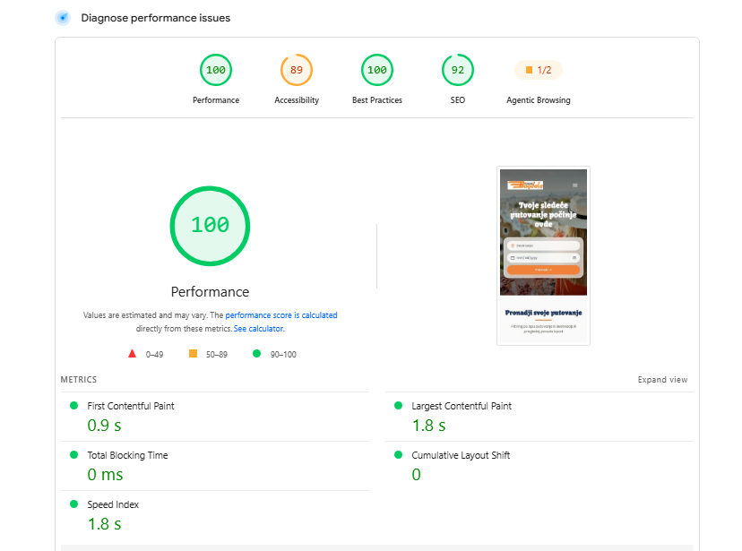
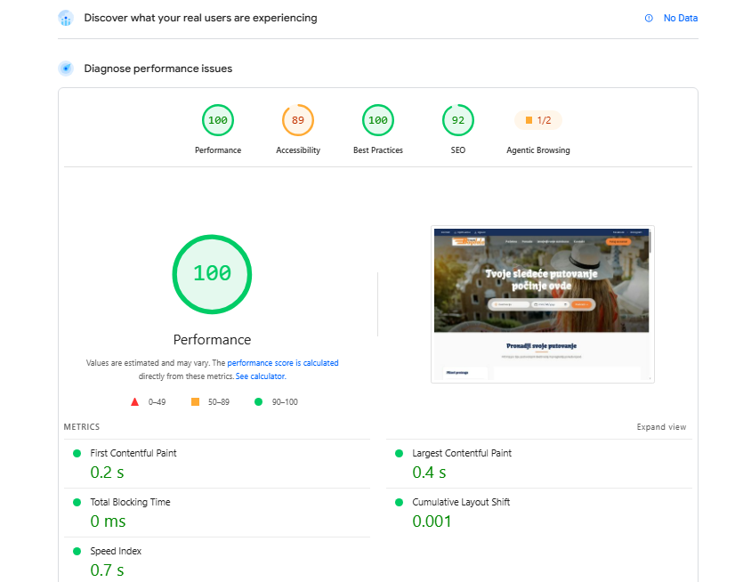

# Bagdala Travel

A custom WordPress theme and reservation system for a tourist agency, built with **Sage 11**, **Laravel Blade**, **Tailwind CSS v4**, and **Vite**.

The project replaces an off-the-shelf booking stack with a **purpose-built reservation workflow** tailored to the agency's actual process — trips, availability, reservations, and passenger capacity managed directly from WordPress.

**[Live website](https://bagdalatravel.rs/)** · **[PageSpeed report](https://pagespeed.web.dev/analysis/https-bagdalatravel-rs/h79tr8nnxt?form_factor=desktop)**

---

## Performance — 100/100

The production site achieves **100/100 on Google PageSpeed Insights, on both mobile and desktop**, without a page builder, a caching plugin, or a CDN.

| Mobile | Desktop |
| :---: | :---: |
|  |  |

### Key optimisations

- **Preload with the `media` attribute** on the LCP image — prevents the browser from downloading both desktop and mobile variants
- `<picture>` element with mobile-specific hero images — **800×600 for mobile**, **1600×900 for desktop**
- `fetchpriority="high"` on above-the-fold images, `loading="lazy"` on everything below
- WebP images at quality 72
- Custom image size via `add_image_size('trip-card', 480, 300)`, with a retina variant
- `.htaccess` — 1-year cache for hashed assets, 6-month cache for images, gzip compression
- Removed WordPress bloat — Gutenberg block CSS, emoji scripts, Heartbeat API, jQuery Migrate
- Server-rendered Blade templates
- Vite production build

---

## Custom Reservation System

The core of the project.

Rather than relying on a third-party booking plugin, the reservation workflow is implemented directly in the theme and tailored to the agency's actual business process.

### Reservation flow

1. A visitor selects a trip and submits the reservation form through an **AJAX modal**, without a page reload
2. The reservation is stored as a `rezervacija` custom post type
3. The customer receives an automatic HTML email confirming that the request has been received
4. The agency receives an HTML notification email with the customer's reservation details
5. The reservation becomes available in the WordPress admin for further processing

### Statuses
pending → waiting_payment → confirmed
↓
cancelled

text

All three active statuses (`pending`, `waiting_payment`, `confirmed`) are counted against a trip's availability. `cancelled` reservations are excluded.

### Seat management

Each trip has an optional capacity, defined via SCF. Available seats are calculated as:
ukupno_mesta − web_rezervacije − rezervisano_rucno

text

- **`ukupno_mesta`** — total trip capacity (set by the agency)
- **`web_rezervacije`** — passengers from online reservations (auto-counted)
- **`rezervisano_rucno`** — offline/phone reservations (adjusted manually by the agency)

**Optional:** if the agency leaves `ukupno_mesta` empty, the reservation button works without limits and no seat counter is shown.

### Manual (offline) reservations

The agency can adjust the `rezervisano_rucno` field when a booking arrives by phone or in person, keeping online and offline availability in sync.

---

## Automated Emails

Two HTML emails are sent on every reservation:

- **To the customer** — trip details, passenger breakdown, reservation number, "we'll contact you shortly"
- **To the agency** — customer name, phone, email, passenger count, notes, direct link to the admin

Both use inline CSS and are optimised for email clients.

---

## Tech Stack

| Layer | Technology |
|---|---|
| CMS | WordPress |
| Theme | Sage 11 (Roots) |
| Templating | Laravel Blade |
| Styling | Tailwind CSS v4 |
| Build | Vite |
| Custom fields | Secure Custom Fields (SCF) |
| Backend | PHP 8.2+ |
| Frontend | Vanilla JavaScript (AJAX) |
| Dependencies | Composer, NPM |

---

## Project Structure

```
wp-content/themes/bagdala/
├── app/
│   ├── setup.php              Theme setup, CPT, SCF fields
│   ├── filters.php
│   └── reservations/          Booking system module
│       ├── cpt.php            CPT + field groups
│       ├── helpers.php        Seat counting, auto-calculations
│       ├── ajax.php           Reservation submission handler
│       └── emails.php         HTML email templates
│
├── resources/
│   ├── css/app.css            Tailwind + @theme tokens
│   ├── js/app.js              Modal, slider, interactions
│   ├── fonts/                 Local Poppins + Kavoon
│   ├── images/                Theme images (with mobile variants)
│   └── views/
│       ├── layouts/           App layout
│       ├── sections/          Hero, header, footer, listings
│       ├── partials/          card-trip, reservation-modal
│       └── single-putovanje.blade.php
│
└── public/build/              Vite output (gitignored)
```

## Setup

### Requirements

- PHP 8.2+
- Node.js
- Composer
- WordPress 6.5+
- Secure Custom Fields plugin

### Installation

Clone into `wp-content/themes/` and install dependencies:

```bash
composer install
npm install
Copy the environment file and configure:

bash
cp .env.example .env
text
WP_HOME=http://your-local-url.test
WP_SITEURL=http://your-local-url.test
Build assets:

bash
npm run build     # production
npm run dev       # development with hot reload
Activate the theme from Appearance → Themes.

Development Workflow
text
Design (Figma)
      ↓
Sage 11 theme scaffold
      ↓
Blade + Tailwind components
      ↓
Custom SCF fields & CPT
      ↓
Reservation system (PHP + AJAX)
      ↓
Vite production build
      ↓
Deployment to live server
      ↓
PageSpeed verification
Highlights
Custom reservation system — no third-party booking plugin

AJAX-powered modal, no page reload

Automated HTML email notifications (customer + agency)

Dynamic seat availability with online + offline reservation support

Automatic trip ordering by departure date

Custom SCF fields for trip management

100/100 PageSpeed — built into the theme, not bolted on

Modular architecture (app/reservations/) for easy maintenance

License
Code is released under the MIT License — see LICENSE.md.

Client content (text, images, branding, trip data) is not included in that license and remains the property of the client.
